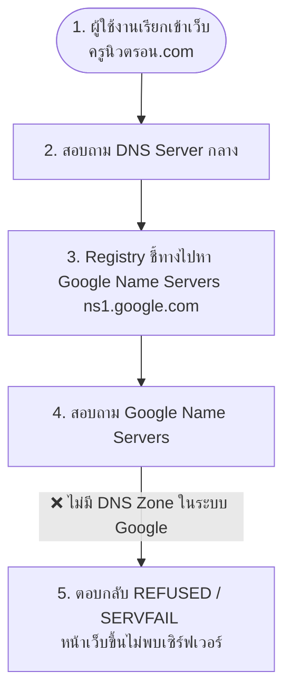

# รายงานการตรวจสอบระบบ DNS: ครูนิวตรอน.com 🌐

**ข้อมูลโดเมน:** `ครูนิวตรอน.com` (Punycode: `xn--42c8alb1cc0a4c3c6b.com`)  
**เป้าหมายการเชื่อมต่อ:** GitHub Pages (`kunewnew.github.io/satit-tools`)  
**วันที่ตรวจสอบ:** 14 มิถุนายน 2569 (2026)

---

## 🔍 ผลการตรวจสอบสถานะปัจจุบัน

จากการตรวจสอบระบบ DNS จากเซิร์ฟเวอร์ภายนอกและระดับ Root Registry (VeriSign) ได้ผลลัพธ์ดังนี้ครับ:

1. **การตั้งค่าฝั่ง GitHub Pages:** 
   - ตั้งค่าฝั่ง GitHub Pages เรียบร้อยดีมากครับ ระบบตรวจสอบพบไฟล์ `CNAME` และผูกโดเมน `xn--42c8alb1cc0a4c3c6b.com` ในระบบของ Repository [satit-tools](https://github.com/kunewnew/satit-tools) เรียบร้อยแล้ว
2. **การชี้ Name Servers (NS) ของโดเมน:**
   - โดเมนเนมจดผ่านระบบผู้แทนจำหน่ายของ **PublicDomainRegistry (PDR)**
   - ปัจจุบันถูกกำหนดให้ชี้ไปที่ Name Servers ของ Google:
     - `ns1.google.com`
     - `ns2.google.com`
     - `ns3.google.com`
     - `ns4.google.com`
3. **ปัญหาการตอบรับของ DNS (DNS Resolution Failure):**
   - เมื่อมีผู้เรียกเข้าหน้าเว็บ ระบบของ Google Name Servers ตอบกลับมาเป็นสถานะ **`REFUSED` (ปฏิเสธคำขอ)**
   - **สาเหตุ:** แม้ระบบโดเมนภายนอกจะชี้มาหา Google แต่เนื่องจากในระบบบัญชี Google Cloud / Google Workspace ของคุณครูไม่ได้มีการสร้างหรือเปิดใช้งาน **DNS Zone** สำหรับโดเมนนี้ ทำให้เซิร์ฟเวอร์ของ Google ปฏิเสธการตอบคำถามเรื่อง IP Address ส่งผลให้หน้าเว็บขึ้นแจ้งเตือนหาเซิร์ฟเวอร์ไม่เจอ (Domain DNS cannot be resolved)

---

## 🛠️ ขั้นตอนการแก้ไขปัญหา (เลือกทำตามวิธีที่สะดวก)

การแก้ไขจะขึ้นอยู่กับว่าคุณครูไปสร้างรายการ DNS Records (A Records 4 ตัว และ CNAME 1 ตัว) ไว้ที่แผงควบคุมใดครับ:

### วิธีที่ 1: หากกรอก DNS Records ไว้ที่เว็บผู้ให้บริการโดเมน (เช่น Hostatom, Netway, หรือแผงจดโดเมนอื่น ๆ)
แผงควบคุม DNS ของผู้ให้บริการจดโดเมนจะทำงานก็ต่อเมื่อโดเมนนั้นใช้ Name Servers ของตัวเขาเอง
1. ล็อกอินเข้าสู่เว็บผู้ให้บริการที่คุณครูจดโดเมนไว้
2. เข้าไปที่เมนู **จัดการ Name Servers (Manage Name Servers)**
3. เปลี่ยนค่า Name Servers จาก Google กลับไปใช้ **"ค่าเริ่มต้นของผู้ให้บริการ" (Default Name Servers)** ตัวอย่างเช่น:
   - ของ Hostatom มักจะเป็น `ns1.hostatom.com` / `ns2.hostatom.com`
   - หรือเลือกติ๊กปุ่ม **"ใช้ Name Server เริ่มต้นของระบบ"**
4. บันทึกค่า และรอการอัปเดต (ใช้เวลาประมาณ 1 - 4 ชั่วโมง)

---

### วิธีที่ 2: หากต้องการใช้งาน Google Cloud DNS (สำหรับจัดการ DNS บน Google)
หากต้องการให้ Google เป็นผู้ถือ DNS Records จริง ๆ (กรณีทำ DNS Zone บน Google Cloud ไว้แล้ว)
1. ล็อกอินเข้าสู่ [Google Cloud Console (Cloud DNS)](https://console.cloud.google.com/net-services/dns/zones)
2. ค้นหา Zone ของ `xn--42c8alb1cc0a4c3c6b.com`
3. ตรวจสอบกลุ่ม **Name Servers (NS)** ที่ Google Cloud DNS สุ่มสร้างให้สำหรับ Zone นี้
   - *หมายเหตุ:* ปกติจะไม่ใช่ `ns1.google.com` ตรง ๆ แต่จะเป็นกลุ่มจำพวก `ns-cloud-c1.googledomains.com`, `ns-cloud-c2.googledomains.com`, ...
4. คัดลอกค่า Name Servers ทั้ง 4 ตัวนี้ ไปตั้งค่าในแผงจดโดเมนของคุณครูแทนตัวเดิม

---

### วิธีที่ 3: ใช้ Cloudflare DNS (ฟรี แนะนำมากที่สุดสำหรับ GitHub Pages)
วิธีนี้ทำได้ง่าย ปลอดภัย และช่วยให้ใบรับรอง SSL (HTTPS) ของ GitHub Pages ทำงานได้อย่างรวดเร็ว
1. สมัครสมาชิกฟรีที่ [Cloudflare.com](https://www.cloudflare.com/)
2. กด **Add a Site** แล้วกรอกโดเมน: `ครูนิวตรอน.com`
3. เลือกแพ็กเกจแบบ **Free**
4. ระบบจะทำการสแกนข้อมูล DNS เก่า หากไม่ขึ้นข้อมูล ให้ใส่ค่าเหล่านี้เพิ่ม:
   - **Type A:** `@` ชี้ไปที่ `185.199.108.153`
   - **Type A:** `@` ชี้ไปที่ `185.199.109.153`
   - **Type A:** `@` ชี้ไปที่ `185.199.110.153`
   - **Type A:** `@` ชี้ไปที่ `185.199.111.153`
   - **Type CNAME:** `www` ชี้ไปที่ `kunewnew.github.io` (ปิด Proxy status หรือเปิดเป็น DNS Only ชั่วคราวเพื่อให้ GitHub ออก SSL ได้ง่าย)
5. Cloudflare จะแสดง Name Servers ใหม่มาให้ 2 ตัว (เช่น `xxxx.ns.cloudflare.com`)
6. ล็อกอินเข้าเว็บที่จดโดเมน นำ Name Servers 2 ตัวนี้ไปใส่แทนของเดิม

---

## 🚀 ขั้นตอนถัดไปหลังจากแก้ไข DNS สำเร็จ

เมื่อคุณครูเปลี่ยน Name Servers จนกระทั่งเว็บเริ่มชี้มาที่ IP ของ GitHub สำเร็จแล้ว ให้ทำตามขั้นตอนถัดไปใน GitHub Pages:

1. เข้าไปที่ Repository [satit-tools](https://github.com/kunewnew/satit-tools) บน GitHub
2. ไปที่แท็บ **Settings** -> เลือกเมนู **Pages** ด้านซ้าย
3. เลื่อนลงไปที่หัวข้อ **Custom domain**
4. สังเกตที่ชื่อโดเมน `ครูนิวตรอน.com` 
5. รอจนปุ่ม **Enforce HTTPS** สามารถคลิกได้ (เปิดใช้งานสวิตช์ HTTPS)
   - *หมายเหตุ:* GitHub Pages จะสร้างใบรับรอง SSL Certificate ให้โดยอัตโนมัติภายใน 10 - 30 นาทีหลังจาก DNS ชี้มาถูกต้องแล้ว
6. ทดลองเข้าใช้งานผ่านลิงก์ `https://ครูนิวตรอน.com` หรือ `https://www.ครูนิวตรอน.com` ได้เลยครับ!
