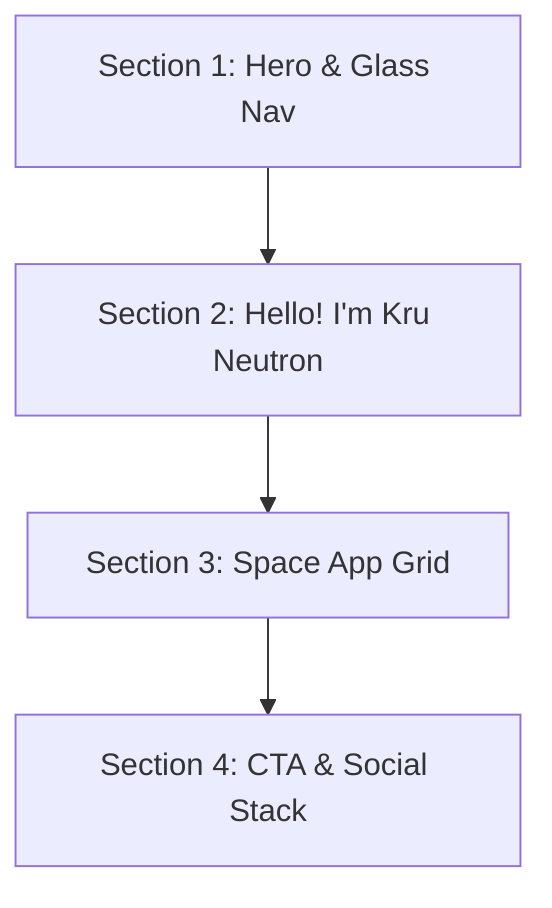

# แผนการออกแบบ: พอร์ตทัลเว็บครูนิวตรอนในสไตล์ "Orbis.Nft" Space Theme

เอกสารนี้แสดงแผนการออกแบบและจำลองหน้าเว็บ **ครูนิวตรอน.com** โดยการนำระบบดีไซน์สุดพรีเมียมจากดีไซน์ **"Orbis.Nft"** มาปรับใช้กับฟังก์ชันและเครื่องมือสอนจริงของพี่ เพื่อให้ได้เว็บที่สวยหรู ทันสมัย และดูเป็นมืออาชีพสูงสุดครับ

---

## 🎨 1. ระบบดีไซน์และธีม (Design System & Aesthetics)

*   **สีหลัก (Color Palette):**
    *   **Background:** `#010828` (สีน้ำเงินเนวี่เข้มลึกแบบห้วงอวกาศ)
    *   **Text (Cream):** `#EFF4FF` (สีครีมขาวสว่างนวลตา ใช้สำหรับตัวหนังสือเกือบทั้งหมด)
    *   **Accent (Neon Green):** `#6FFF00` (สีเขียวสะท้อนแสง ใช้เน้นข้อความลายมือและเส้นขีดเส้นใต้)
*   **ฟอนต์ (Typography):**
    *   **Anton (Google Font):** ฟอนต์ตัวหนา ขอบเหลี่ยมสไตล์โมเดิร์น ใช้กับหัวข้อหลักและปุ่มเมนูทั้งหมด (ภาษาอังกฤษแสดงตัวพิมพ์ใหญ่ทั้งหมด)
    *   **Condiment (Google Font):** ฟอนต์ลายมือเขียนพริ้วไหวสีเขียวสะท้อนแสง ใช้สำหรับข้อความตกแต่งที่ซ้อนเหลื่อมด้านหลังเพื่อเพิ่มเลเยอร์ดีไซน์
    *   **Monospace Font:** ใช้สำหรับคำอธิบายทั่วไปและตัวเลขอ้างอิง
*   **เอฟเฟกต์กระจกเหลว (Liquid Glass Effect):**
    *   ใช้คลาสพิเศษ `.liquid-glass` ในการทำกรอบการ์ด ปุ่ม และแถบนำทาง ซึ่งจะให้ฟีลกระจกเบลอสะท้อนแสงแบบหรูหรา:
    ```css
    .liquid-glass {
      background: rgba(255, 255, 255, 0.01);
      background-blend-mode: luminosity;
      backdrop-filter: blur(4px);
      -webkit-backdrop-filter: blur(4px);
      border: none;
      box-shadow: inset 0 1px 1px rgba(255, 255, 255, 0.1);
      position: relative;
      overflow: hidden;
    }
    ```
*   **พื้นผิวทับซ้อน (Texture Overlay):**
    *   มีฟิลเตอร์เม็ดทรายจางๆ (`/texture.png` แบบครอบโปร่งแสง 60%) แสดงทับอยู่ด้านหน้าสุดตลอดเวลาแบบ Fixed เพื่อให้มิติภาพดูคลาสสิกเหมือนภาพฟิล์มภาพยนตร์

---

## 🗺️ 2. โครงสร้างเว็บแบ่งออกเป็น 4 ส่วน (4-Section Layout)



---

### 🌌 ส่วนที่ 1: หน้าแรกต้อนรับแบบห้วงมิติ (Hero Section - Full Viewport)
*   **วิดีโอพื้นหลัง:** เล่นวนลูปห้วงอวกาศที่มีวัตถุหมุนโคจรจากลิงก์ CloudFront (ตัดขอบมุมล่างโค้งมนหรูหรา `rounded-b-[32px]`)
*   **แถบนำทางด้านบน (Glass Navbar):** แถบกระจกโค้งมนลอยตัว แสดงเมนูภาษาอังกฤษพิมพ์ใหญ่ทั้งหมด:
    *   `HOMEPAGE` | `ATTENDANCE` | `ASSIGNMENT` | `MINIGAMES` | `MATH PORTAL`
*   **ข้อความหลัก:** อักษรตัวหนาเรียงซ้อนกัน
    > BEYOND TEACHING
    > AND ( ITS ) FAMILIAR BOUNDARIES
*   **คำเน้นสะท้อนแสง:** คำว่า *"Classroom portal"* เขียนด้วยฟอนต์ลายมือสีเขียวสะท้อนแสงซ้อนอยู่ด้านหลังเอียงเล็กน้อย
*   **ปุ่มติดต่อด้านขวา:** ปุ่มกระจกรูปสี่เหลี่ยมโค้งมนเรียงแถวดิ่ง (Mail, Twitter, Line)

---

### 🧑‍🏫 ส่วนที่ 2: แนะนำตัวตนและวิสัยทัศน์ (About/Intro Section - Full Viewport)
*   **วิดีโอพื้นหลัง:** แสงเนบิวลาเคลื่อนไหวจางๆ ในอวกาศลึก
*   **หัวข้อหลัก:**
    > HELLO!
    > I'M KRUNEWTRON
    *   มีคำว่า *"Krunewtron"* ตัวเขียนสีเขียวสะท้อนแสงเอียงทับอยู่ด้านล่างขวา
*   **ข้อความอธิบาย (ขวา):** ใช้ฟอนต์เว้นระยะแบบพิมพ์ดีดสีครีม:
    > "A DIGITAL CLASSROOM SYSTEM FIXED BEYOND TIME AND PLACE. AN EXPLORATION OF LEARNING, GRADES, AND COLLABORATION IN MODERN EDUCATION."

---

### 🦆 ส่วนที่ 3: ระบบงานและห้องเรียนคณิตศาสตร์ (App Grid Section)
*   **พื้นหลัง:** สีน้ำเงินเข้มลึก `#010828` นิ่งสงบแบบไม่มีวิดีโอมารบกวนสายตา
*   **หัวข้อหลัก:**
    > COLLECTION OF
    > [Space] CLASSROOM TOOLS
    *   คำว่า *"Space"* เป็นตัวเขียนสีเขียวสะท้อนแสง และคำว่า *"CLASSROOM TOOLS"* ขยับย่นระยะเข้าไปด้านขวาอย่างสวยงาม
*   **ปุ่มขวาบน:** ปุ่มตัวอักษรเรียงซ้อนกันเขียนว่า `SEE ALL TOOLS` มีขีดล่างเส้นหนาสีเขียวสะท้อนแสงเด่นชัด
*   **ตารางการ์ดระบบงาน (NFT Card Grid 3 คอลัมน์):**
    *   การ์ดทำด้วยกรอบกระจกเหลวโค้งมน `rounded-[32px]`
    *   ข้างในการ์ดแต่ละใบประกอบด้วย **วิดีโอตัวอย่างการทำงานสั้นๆ เล่นวนลูปของระบบนั้น** (เช่น วิดีโอเป็ดวิ่งแข่งสามมิติ, วิดีโอกล้องสแกน หรือหน้าตาเกม)
    *   ด้านล่างมีการ์ดแถบข้อมูลสีดำโปร่งแสง แสดงประเภทระบบและคะแนนประสิทธิภาพ:
        *   **การ์ด 1:** ระบบเช็คชื่อรายวิชา (APP STATUS: ACTIVE | 9.8/10) พร้อมปุ่มสีม่วงโกลว์โฮเวอร์ขยายขนาดสะท้อนแสงเพื่อกดเข้าใช้งาน
        *   **การ์ด 2:** ระบบติดตามส่งงาน / ข้อสอบ (APP STATUS: READY | 9.5/10)
        *   **การ์ด 3:** คลังคณิตศาสตร์ ครูนิวตรอน (APP STATUS: UPDATED | 9.7/10)

---

### 🚀 ส่วนที่ 4: ชวนร่วมขับเคลื่อนอนาคต (CTA / Final Section)
*   **วิดีโอพื้นหลัง:** การเดินทางทะลุมิติอวกาศลึกแบบเต็มความกว้างสัดส่วนปกติ
*   **กลุ่มข้อความปลุกใจ (ขวา):**
    > TEACH BEYOND.
    > ENGAGE THE CLASS.
    > TRACK THE PROGRESS.
    > FOLLOW THE SIGNAL.
*   **แผงเมนูดิ่งด้านซ้ายล่าง:** แผงกระจกแนวตั้งแสดงช่องทางการส่งข้อความติดต่อ มีเส้นขอบบางๆ แบ่งแต่ละช่องทางชัดเจน

---

## ❓ คำถามและข้อตกลงก่อนเริ่มทำจริง

> [!IMPORTANT]
> 1. พี่อยากให้นำการออกแบบระบบนี้ไปสร้างแยกเป็นหน้าใหม่ไปเลย (เช่นสร้างไฟล์ `space-portal.html` หรือทำเป็นหน้ากึ่งแฝด) หรืออยากให้นำดีไซน์นี้ไปแทนที่ทับหน้าแรก `index.html` ของเดิมไปเลยครับ?
> 2. เนื่องจากของเดิมพี่มีฟังก์ชันจำพวก **กล่องจดบันทึก (Memo Notepad)** และ **นาฬิกาบอกเวลา** อยู่ด้านล่างซ้าย พี่อยากให้ผมจัดวางสิ่งนี้แทรกเข้าไว้ในดีไซน์ใหม่ตรงจุดไหนเป็นพิเศษไหมครับ?
